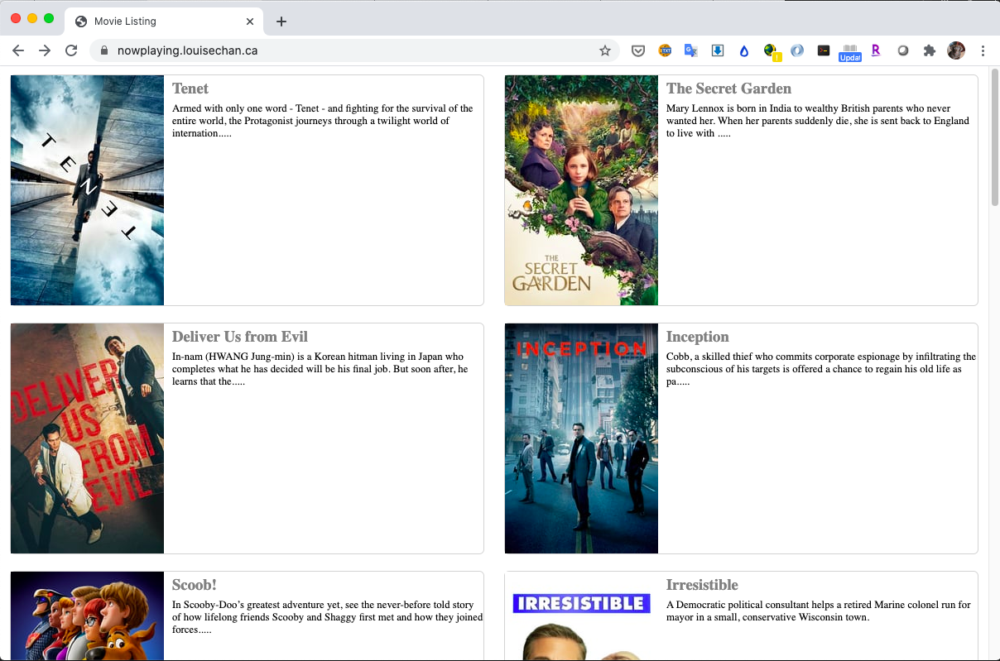
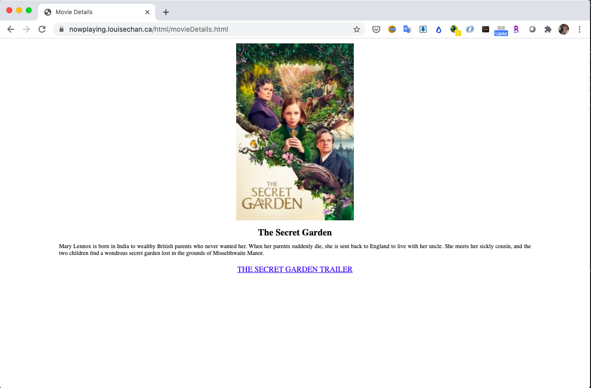

# Now Playing

#### A web app that provides a clickable listing of all movies that are now playing using RESTful APIs from https://api.themoviedb.org.

#### Technology/Concepts used

* HTML5, CSS3, JavaScript

* Flexbox, RESTful APIs

* JSON data parsing operations

* Promise processing and exception handling

#### Screenshots

      

#### Features
* 2-column layout of movies that are now playing in theatres or movies now streaming online.

* Movie list are taken from an API site assuring user of most recent list of movies that are now playing.

* Each movie is clickable and will redirect user to a new tab showing details of the movie.

* Movie details contain link to Youtube trailer taken from a movie trailer API site.

#### Live webpage link: https://nowplaying.louisechan.ca/

#### Link to game specification: <a href="./docs/MADS4007- Final Exam.pdf" target="_blank">[App Specification]</a>
